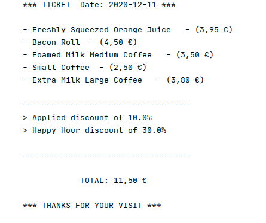

# Cognizant Demo: Charlene's Coffee Corner

## What about the design pattern I chose?

You'll notice I chose the well known Decorator design pattern. I think it's like an easier wa
to extend functionallity over a pre existing product available in the coffee shop. 

Instead of subclassing an having a subclass for each product, you can have a base product 
(i.e. coffee, roll or juice) and extend it with new extras (i.e. large, medium or small coffee or orange juice).
What if tomorrow Charlene wants to offer a Strawberry juice? No worries. Just create a new decorator Strawberry class.

Finally, in order to print a ticket, I created a Ticket interface (and a default implementation),
in order to add new elements and print them in the ticket format.

## How can I run it?

Make sure you have `maven` installed in your computer. If not, open your shell terminal and type:

```shell script
sudo apt install maven
```

If you already have it installed, and you wanna run this demo, just type the command below:

```shell script
mvn compile && mvn exec:java -Dexec.mainClass="com.cognizant.demo.App"
```

Once you execute it, you'll see a default ticket printed.

## Output sample

Here the sample of the code printed when executed.


